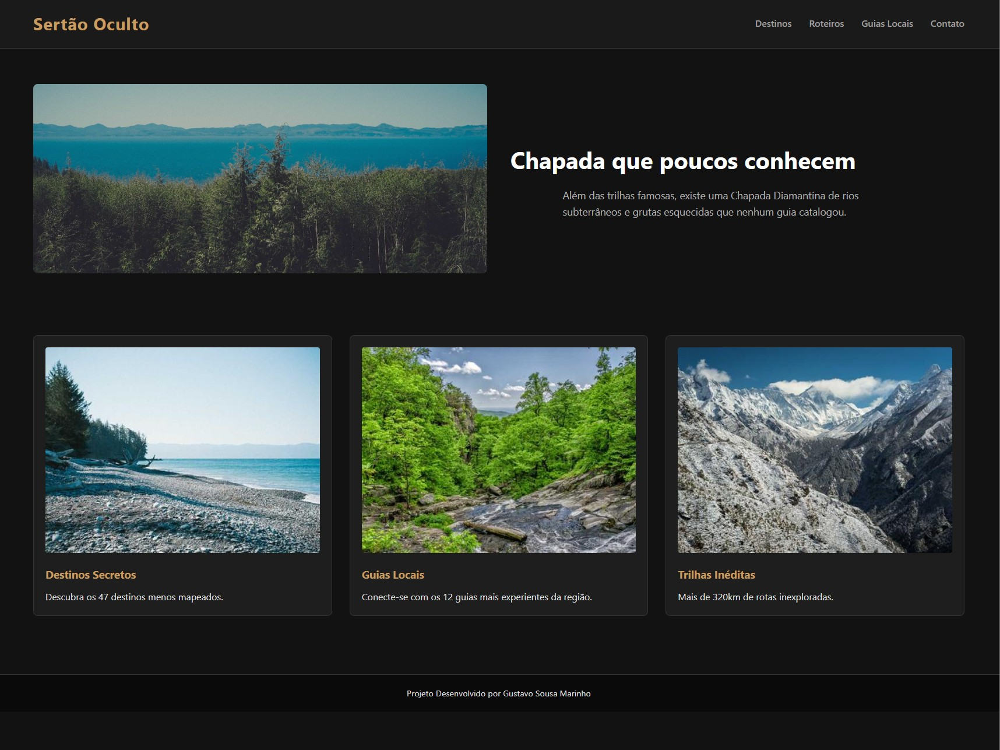
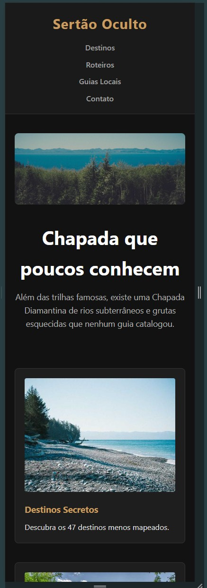

# Projeto Web - Chapada Diamantina

## 1. Dados básicos
* **Nome:** Gustavo Sousa Marinho
* **Matrícula:** 924365
* **Proposta:** Proposta 2 - Lugares e Experiências

## Semana 4

## 2. Imagem do esboço (wireframe)

## 3. Print da home-page

## Evolução - Semana 5
O projeto foi atualizado para uma versão responsiva, utilizando os conceitos de **Mobile First**.
Foram aplicadas as seguintes técnicas em CSS Puro:
* **Flexbox:** Utilizado no cabeçalho para alinhar a logo e o menu de navegação.
* **CSS Grid:** Utilizado na seção de destinos para criar um layout de cards em colunas.
* **Media Queries:** Implementadas para adaptar o layout de 1 coluna (dispositivos móveis) para múltiplas colunas (telas maiores a partir de 768px).

### Prints da Versão Responsiva

**Versão Desktop:**

**Versão Mobile:**

